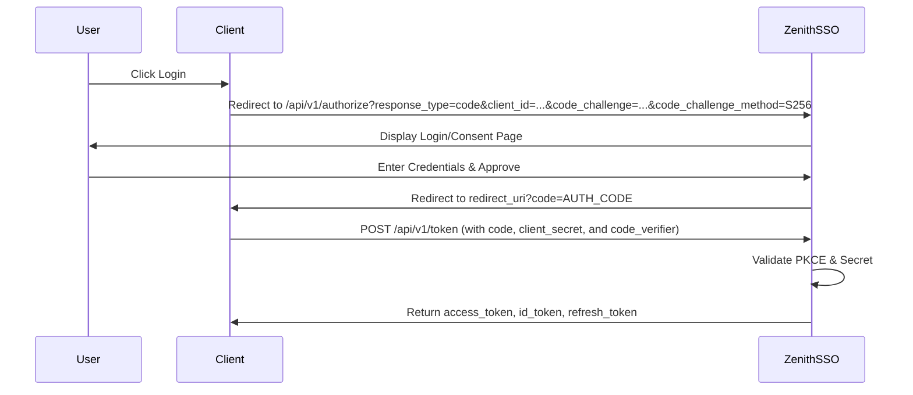

# ZenithSSO - High Performance Identity Provider 🛡️

*Read this in other languages: [English](README.md), [Русский](README_ru.md).*


ZenithSSO is a highly scalable, high-performance Identity Provider (IdP) written in Go. Built with Clean Architecture principles, it provides a robust Single Sign-On (SSO) solution implementing OpenID Connect (OIDC) and OAuth 2.0 with PKCE out-of-the-box.

## ✨ Key Features

*   **OAuth 2.0 & OIDC Standard Compliant:** Supports Authorization Code grant with strict PKCE (`S256` and `plain`) validation.
*   **Secure OIDC Profile:** Complete support for dynamic Issuer binding, conditional ID tokens with `nonce` validation, and standardized profile scopes (`first_name`, `last_name`, `avatar_url`, `locale`).
*   **Strict Client Authentication:** Securely enforce basic authentication or POST body `client_secret` hashing for secure token exchanges.
*   **Whitelist Refresh Tokens:** Secure session management leveraging database-backed whitelisting mapping `ip_address` and `user_agent` to enable features like "Revoke All Sessions".
*   **White-labeling & Extensible UI:** A fast UI embedded into the binary using `go:embed`. Highly customizable using a fallback system (`fs.FS`)—drop your own `web/` folder locally to dynamically override any template or static asset!
*   **Internationalization (i18n):** Native multilingual interface supporting English and Russian, automatically adapting via URL (`?lang=ru`) or the `Accept-Language` browser header.
*   **gRPC & REST APIs:** Headless authentication options using either REST endpoints or high-performance gRPC protobufs.

## 🔄 Authorization Code Flow (with PKCE)



## 🚀 Quick Start

### 1. Configuration (`config.yaml`)

```yaml
sso:
  issuer: "http://localhost:8080"
server:
  secured: false
  port: 8080
datasource:
  url: "localhost:5432"
  db: "auth"
  user: "user"
  password: "password"
ui:
  custom_dir: "./custom_web" # Optional path to override UI
jwt:
  private_key_path: "certs/private.pem"
  public_key_path: "certs/public.pem"
```

### 2. Run the server
Generate RSA keys in `certs/` and start your server:
```bash
go run ./cmd/server
```

## 📚 API Examples

### Fetch Tokens
```bash
curl -X POST http://localhost:8080/api/v1/token \
  -d "grant_type=authorization_code" \
  -d "code=YOUR_CODE" \
  -d "client_id=test_client" \
  -d "client_secret=secret123" \
  -d "redirect_uri=http://localhost/callback" \
  -d "code_verifier=YOUR_PKCE_VERIFIER"
```

### Get User Info
```bash
curl -X GET http://localhost:8080/api/v1/userinfo \
  -H "Authorization: Bearer YOUR_ACCESS_TOKEN"
```
*If granted the `profile` scope, returns `given_name`, `family_name`, `picture`, and `locale`!*

---
Made with ❤️ by standard Go packages.
