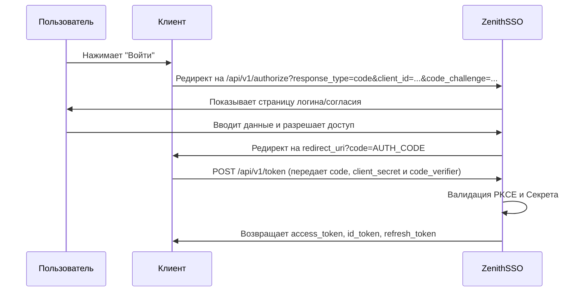

# ZenithSSO - Высокопроизводительный Identity Provider 🛡️

*Читать на других языках: [English](README.md), [Русский](README_ru.md).*


ZenithSSO — это легко масштабируемый и высокопроизводительный Identity Provider (IdP), написанный на Go. Построенный на принципах чистой архитектуры (Clean Architecture), он предоставляет надежное решение для единого входа (SSO) с полной поддержкой OpenID Connect (OIDC) и OAuth 2.0 с PKCE.

## ✨ Основные возможности

*   **OAuth 2.0 и OIDC:** Поддержка Authorization Code flow со строгой валидацией PKCE (`S256` и `plain`).
*   **OIDC Profile Claims:** Динамическая привязка `issuer`, условная генерация ID токена (при наличии `openid` scope) с поддержкой `nonce` и стандартизированного профиля (`first_name`, `last_name`, `avatar_url`, `locale`).
*   **Строгая Аутентификация Клиентов:** Обязательная проверка `client_secret` (через Basic Auth или POST body) с безопасным хэшированием (bcrypt) при обмене токенов.
*   **Белый список Refresh-токенов:** Безопасное управление сессиями на базе БД (Whitelist). Мы отслеживаем `ip_address` и `user_agent`, что позволяет реализовывать такие фичи, как "Завершить все активные сеансы".
*   **White-labeling и Кастомизация UI:** Быстрый пользовательский интерфейс, встроенный прямо в бинарник через `go:embed`. Хотите свой дизайн? Используйте механизм Fallback (через параметр `ui.custom_dir` или локальную папку `web/`) — сервер автоматически подхватит ваши шаблоны!
*   **Мультиязычность (i18n):** Нативный многоязычный интерфейс (Английский и Русский). Язык адаптируется автоматически через URL (`?lang=ru`) или HTTP-заголовок `Accept-Language`.
*   **gRPC & REST API:** Работайте с сервисом как через классический REST, так и через высокопроизводительные gRPC protobufs.

## 🔄 Authorization Code Flow (с PKCE)



## 🚀 Быстрый старт

### 1. Конфигурация (`config.yaml`)

```yaml
sso:
  issuer: "http://localhost:8080"
server:
  secured: false
  port: 8080
datasource:
  url: "localhost:5432"
  db: "auth"
  user: "user"
  password: "password"
ui:
  custom_dir: "./custom_web" # Опционально: путь для переопределения интерфейса
jwt:
  private_key_path: "certs/private.pem"
  public_key_path: "certs/public.pem"
```

### 2. Запуск сервера
Сгенерируйте RSA ключи в папке `certs/` и запустите сервер:
```bash
go run ./cmd/server
```

## 📚 Примеры API

### Получение токенов
```bash
curl -X POST http://localhost:8080/api/v1/token \
  -d "grant_type=authorization_code" \
  -d "code=YOUR_CODE" \
  -d "client_id=test_client" \
  -d "client_secret=secret123" \
  -d "redirect_uri=http://localhost/callback" \
  -d "code_verifier=YOUR_PKCE_VERIFIER"
```

### Получение информации о пользователе
```bash
curl -X GET http://localhost:8080/api/v1/userinfo \
  -H "Authorization: Bearer YOUR_ACCESS_TOKEN"
```
*Если в токене есть scope `profile`, сервис вернет `given_name`, `family_name`, `picture` и `locale`!*

---
Сделано с ❤️ с использованием стандартной библиотеки Go.
